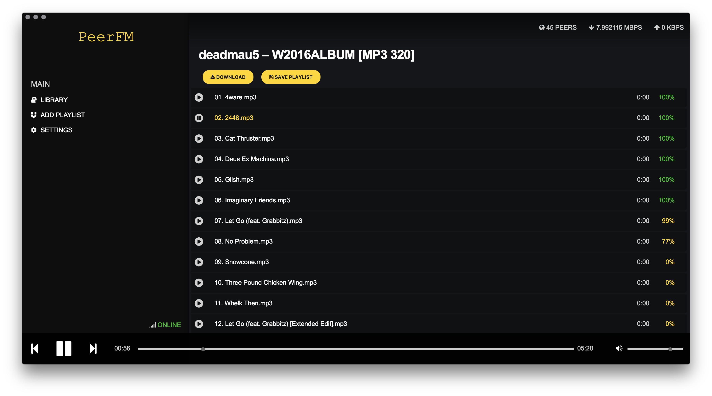

# RadicalFM
A Streaming Peer-to-Peer Desktop Music Player based on [Magnet URIs](https://en.wikipedia.org/wiki/Magnet_URI_scheme).

Built using [Electron](http://electron.atom.io) and [Node.js](https://nodejs.org/).

## Features
* Cross Platform supporting OSX, Windows and Linux!
* Stream or Download Playlists
* BYOM (Bring Your Own Magnet)

## TODO
* Chromecast Support
* Metadata Ingestion
* Settings
* Code Documentation
* Code Optimization
* Tests

## Download
TBA

## Contributing
TBA

## Development
See: [Development](DEVELOPMENT.md)

## License
[MIT License](http://alfg.mit-license.org/)
